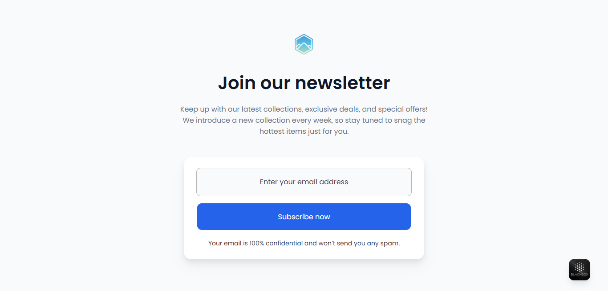

# Newsletter Signup Page

## Project Description
A modern and simple **Newsletter Signup** page designed to collect user emails for updates on the latest products, exclusive deals, and new collections every week.  

The page includes:
- Website logo (`logo.svg`)
- Eye-catching headline: **Join our newsletter**
- Short description to explain the benefits
- Email input form with placeholder
- Submit button **Subscribe now**
- Email privacy message

---

## Features
- **Responsive design** for all screen sizes  
- Centered content using **Flexbox**  
- Input field with **placeholder** text  
- Clear **Call-To-Action button**  
- Email privacy statement  
- Custom favicon (`logo.svg`) in browser tab

---

## Files
- `index.html` → main HTML page  
- `css.css` → styling for the page  
- `logo.svg` → website logo  

---

## Usage
1. Open `index.html` in any modern browser  
2. Enter your email address in the input field  
3. Click **Subscribe now** to submit the email (can be linked later to a backend service)

---

## Notes
- This is a **Front-End only** project, no database connection  
- Can be extended later to connect with email server or subscription management system  

---

## Design
- All elements are **centered** using Flexbox  
- Colors and fonts are easily customizable in `css.css`  
- Texts are clear and readable  

---

## Preview
You can include a screenshot of your page here to show how it looks:
[Demo]()
ج
